# wallgen

Terminal wallpaper generator — fractals, IFS, curves, and image-to-ASCII, output as text, braille, or full-color PNG.

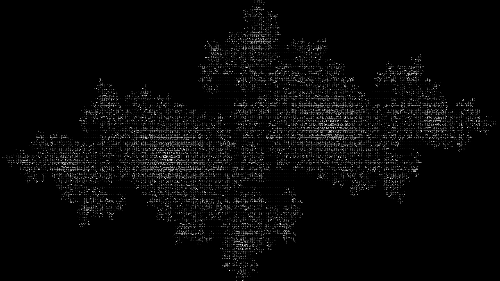

## Gallery

<table>
  <tr>
    <td>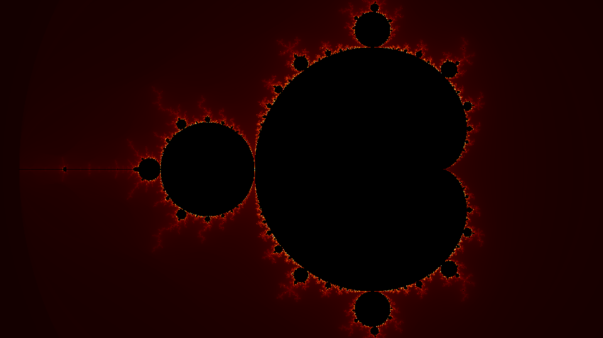</td>
    <td>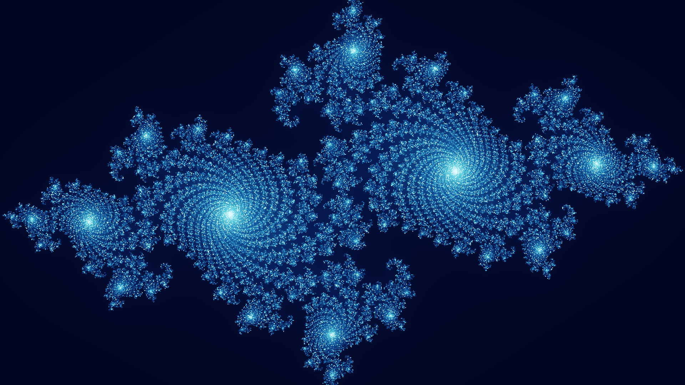</td>
  </tr>
  <tr>
    <td>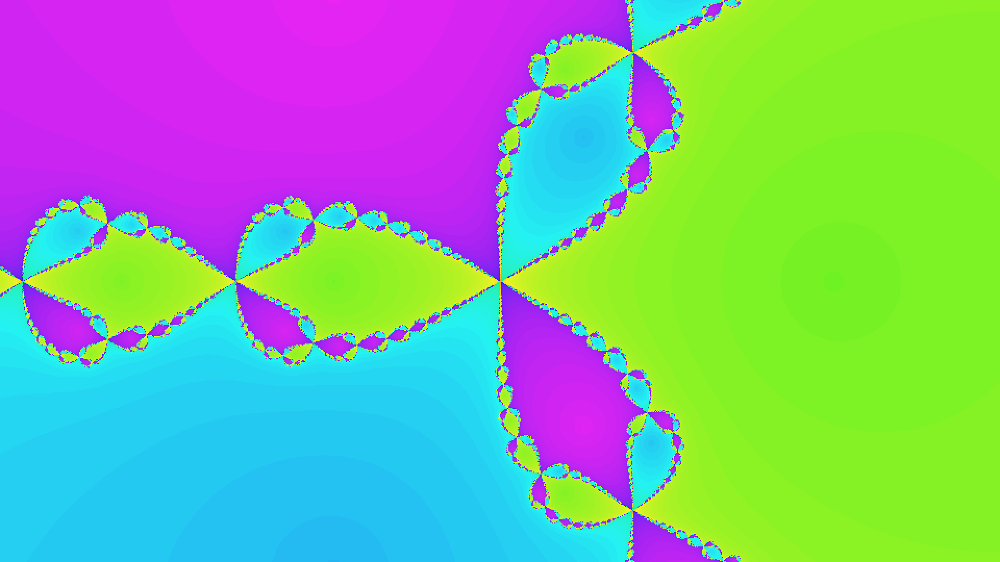</td>
    <td>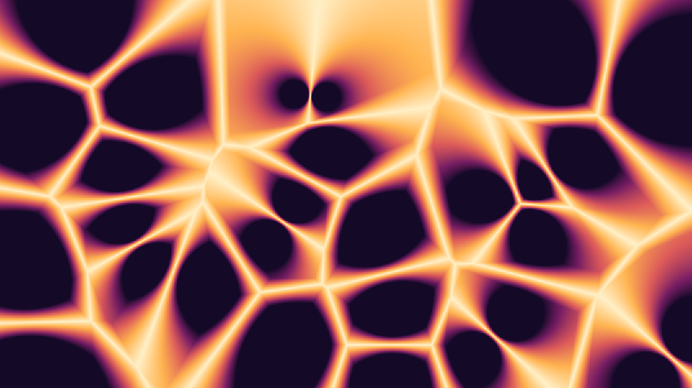</td>
  </tr>
  <tr>
    <td>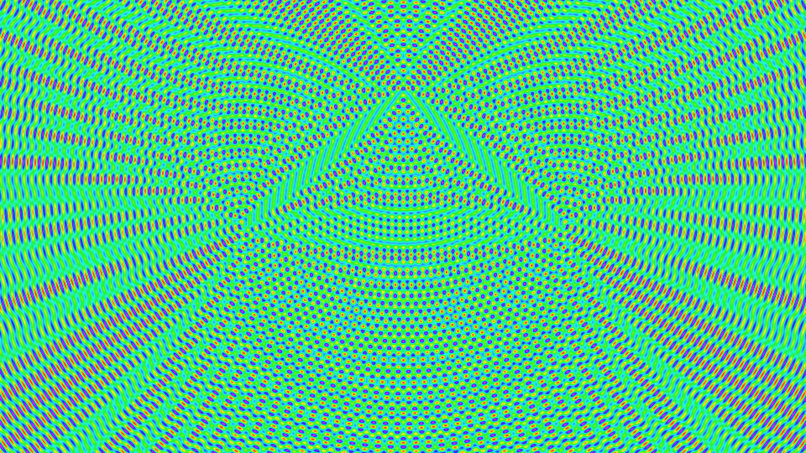</td>
    <td>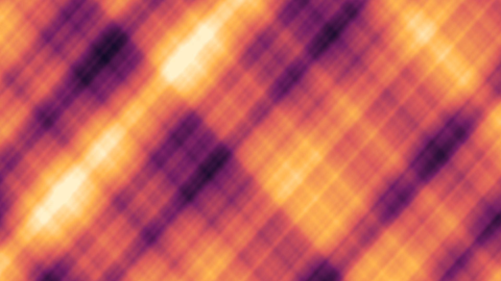</td>
  </tr>
  <tr>
    <td>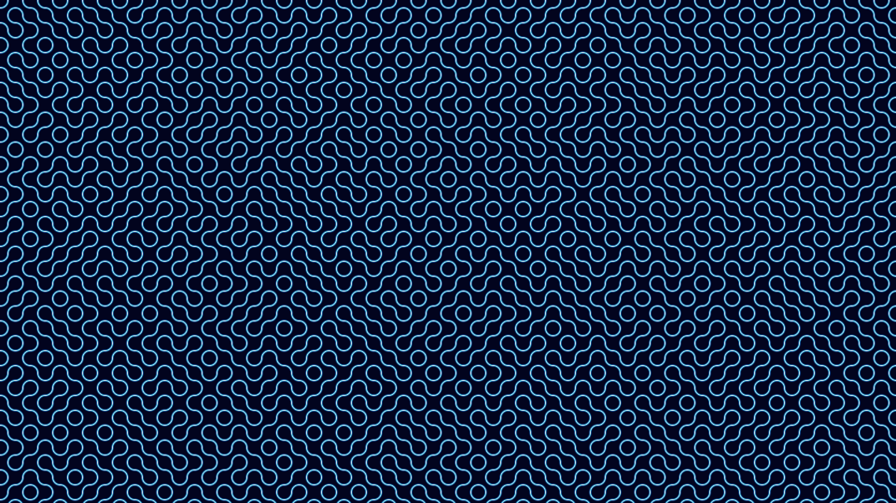</td>
    <td>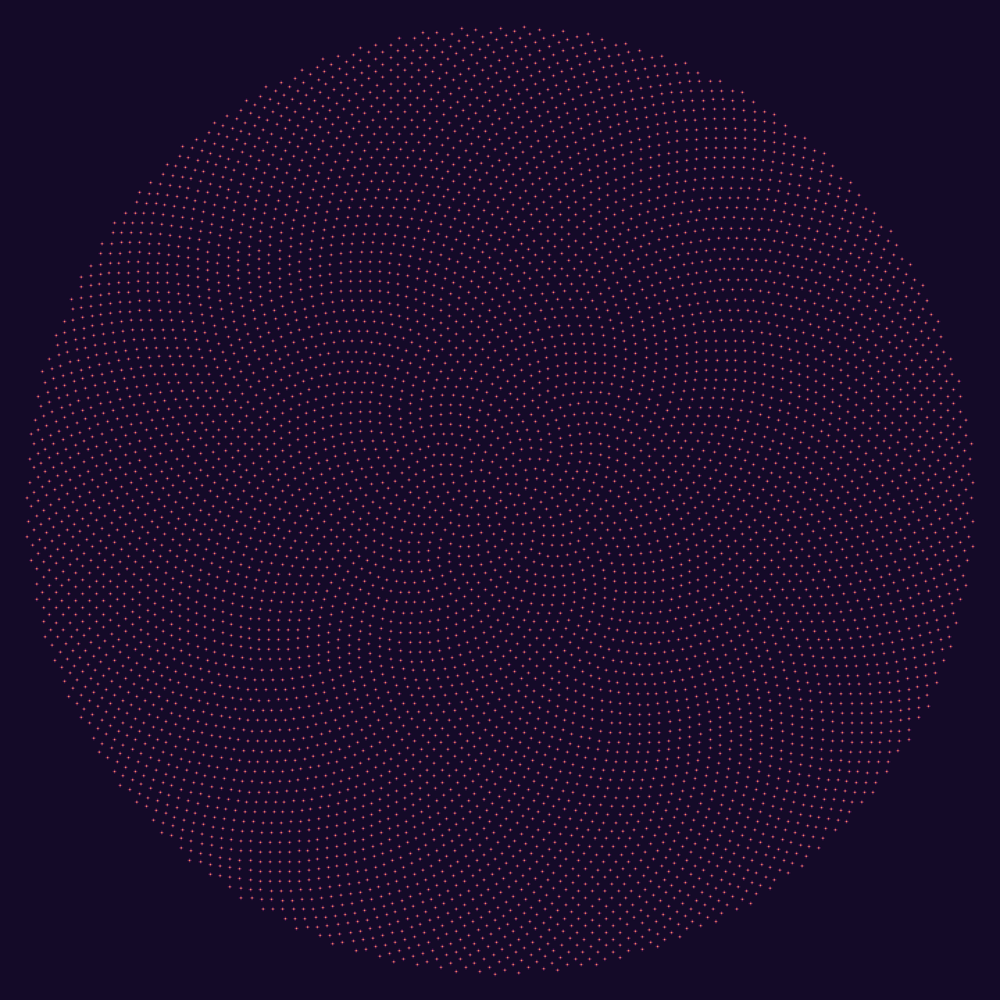</td>
  </tr>
  <tr>
    <td>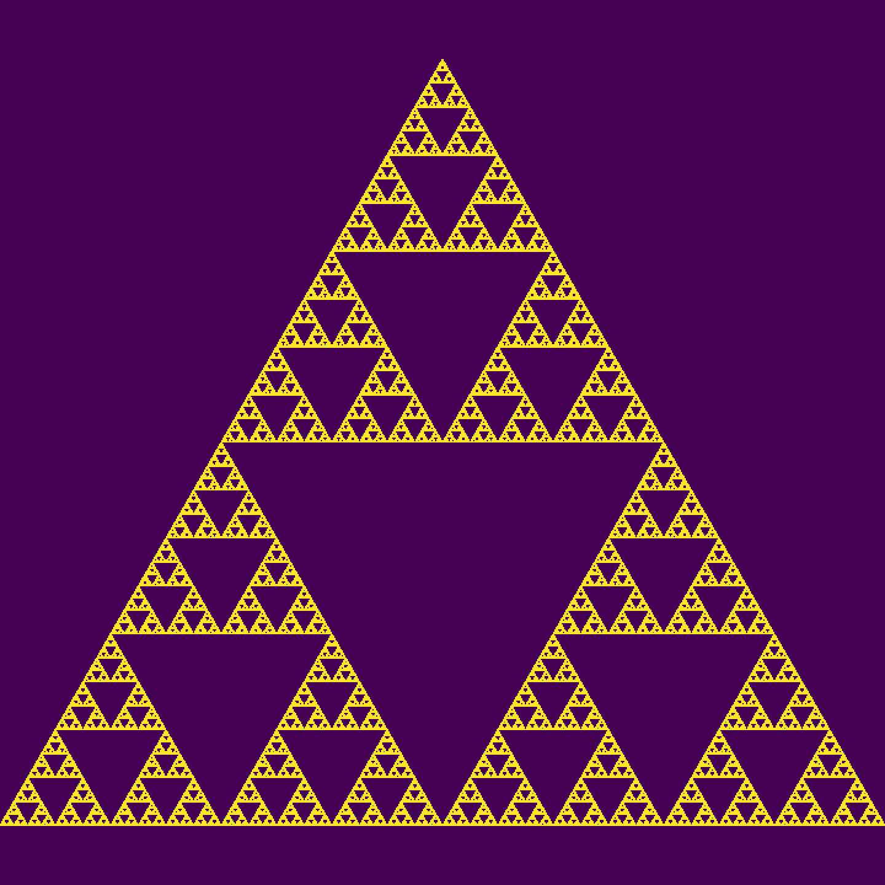</td>
    <td>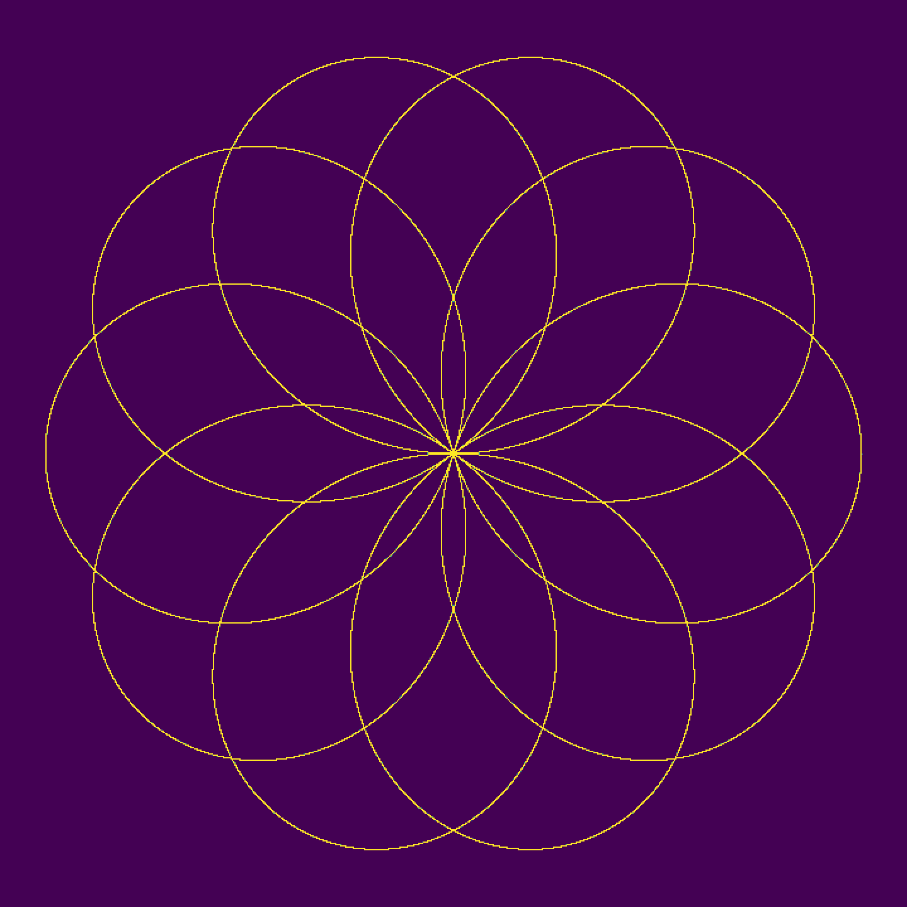</td>
  </tr>
  <tr>
    <td colspan="2" align="center">
      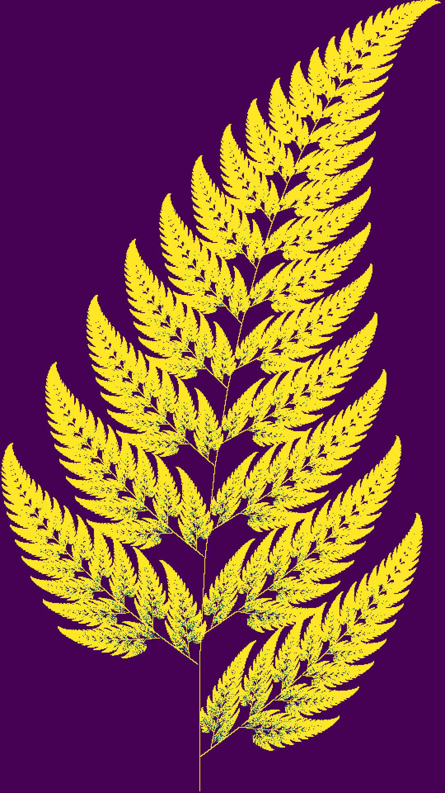
    </td>
  </tr>
</table>

## Install

```bash
go install github.com/osrcmap/wallgen@latest
```

Or grab a prebuilt binary from the [releases page](https://github.com/osrcmap/wallgen/releases).

## Quick start

```bash
# interactive TUI — walks you through every option
wallgen math
wallgen image photo.jpg

# fully flagged, no TUI
wallgen math --no-tui --kind mandelbrot --aspect 16:9 --width 480 \
             --quality high --format png --palette fire --scale 4 -o wall.png

# ascii art straight to terminal
wallgen math --no-tui --kind julia --width 120 --style block
```

## Patterns (14)

| Kind | Description |
|------|-------------|
| `mandelbrot`   | classic z² + c with smooth coloring |
| `julia`        | filled Julia set, c = -0.7269 + 0.1889i |
| `burning_ship` | Mandelbrot variant z = (\|Re\| + i\|Im\|)² + c |
| `newton`       | Newton's method on z³ − 1 — three colored basins of attraction |
| `sierpinski`   | chaos-game equilateral triangle |
| `barnsley`     | IFS fern, four affine maps |
| `lissajous`    | Lissajous curve (a=5, b=4) |
| `spiral`       | Archimedean spiral, turn count scales with quality |
| `rose`         | rhodonea curve, k = 5/4 |
| `phyllotaxis`  | Vogel sunflower model, golden-angle dot field |
| `interference` | three-source wave interference field |
| `plasma`       | sum-of-sines fractal noise |
| `voronoi`      | F2 − F1 distance field over random seeds |
| `truchet`      | random-orientation arc tiles |

## Render styles (text mode)

| Style | Charset | Notes |
|-------|---------|-------|
| `ascii`   | `` .,:;i1tfLCG08@``       | works in any terminal |
| `block`   | `` ░▒▓█``                 | Unicode shading |
| `circle`  | `` ·∘○◍◉●``               | dots / circles  |
| `braille` | `⠀..⣿` (U+2800 range)   | packs 2 × 4 sub-cells per glyph → 8× density |

Style applies to `text`, `png-text`, and `jpg-text` formats. Pixel formats (`png`, `jpg`) ignore it.

## Color palettes (7)

`mono` · `inverse` · `fire` · `ocean` · `viridis` · `rainbow` · `sunset`

## Output formats

| Format | Output | Visual |
|--------|--------|--------|
| `text`     | terminal / `.txt` | unicode characters, single-color stdout |
| `png` / `jpg`         | image file | colored pixel blocks via palette (no glyphs) |
| `png-text` / `jpg-text` | image file | rasterized font glyphs tinted by palette; braille renders as dots |

## Three knobs

| Knob | Affects |
|------|---------|
| **aspect** | shape (W:H) of the output |
| **width** | size - chars across (text) or canvas pixels (image). Final image = width × scale. |
| **quality** | detail per cell - fractal iterations / curve density / supersampling |

Quality steps map to concrete numbers:

| Quality | Fractal iter | Sample multiplier |
|---------|--------------|-------------------|
| low     | 60           | 1×                |
| medium  | 150          | 2×                |
| high    | 400          | 3×                |
| ultra   | 1000         | 4×                |

## Recipes

```bash
# 1080p wallpaper
wallgen math --no-tui --kind julia --aspect 16:9 \
             --width 480 --scale 4 --quality high \
             --format png --palette ocean -o wall.png

# 4K wallpaper
wallgen math --no-tui --kind mandelbrot --aspect 16:9 \
             --width 960 --scale 2 --quality ultra \
             --format png --palette fire -o wall_4k.png

# Phone portrait — Barnsley fern
wallgen math --no-tui --kind barnsley --aspect 9:16 \
             --width 540 --scale 4 --quality ultra \
             --format png --palette viridis -o phone.png

# ASCII art straight to terminal
wallgen math --no-tui --kind lissajous --width 120 --style braille

# Image → ASCII PNG (rasterized chars in color)
wallgen image photo.jpg --no-tui --width 160 \
             --format png-text --style ascii --palette mono \
             --scale 10 -o art.png

# Save text wallpaper to file, view in less
wallgen math --no-tui --kind interference --width 200 --style ascii -o w.txt
less -R w.txt
```

## Text-mode preview

```text
$ wallgen math --no-tui --kind julia --width 60 --style block --quality med

                              ██
                              ░▓▓▒
                         █ ▓▒████░  ▓  █
                         ██████▓▒█░░█▒█           █
                         ▒████▒▒▒███▓▒█░▒░    ██▒██
            ░█   ▓█      ██░░░░░▒███▓▓████▒░  ░░█▓█░█
          ░░██▓░████░▒░░  ░░░█████▓▓███████▓█▓█▓▓▒▓███░▒▒░
          █░█▓▒▒▒▓▓██▓█▓█░▒█░███▒█▓██████████▓▓█▒█▓███▓▒██▒█
    ▒▓░▒██░░░▒██████████████▒▒█▒▒██████████████▒░░░██▒░▓▒
 █▒██▒▓███▓█▒█▓▓██████████▓█▒███░█▒░█▓█▓██▓▓▒▒▒▓█░█
   ░▒▒░███▓▒▓▓█▓█▓███████▓▓█████░░░  ░░▒░████░▓██░░
        █░█▓█░░  ░▒████▓▓███▒░░░░░██      █▓   █░
          ██▒██    ░▒░█▒▓███▒▒▒████▒
          █           █▒█░░█▒▓██████
                     █  ▓  ░████▒▓ █
                           ▒▓▓░
                             ██
```

## TUI

Running any subcommand without flags drops you into an interactive wizard. After every step the equivalent CLI command is printed, so you can copy-paste it later instead of running the TUI again.

## Build from source

```bash
git clone https://github.com/osrcmap/wallgen.git
cd wallgen
go build -o wallgen .
./wallgen --help
```

Requires Go ≥ 1.23.

## License

MIT
